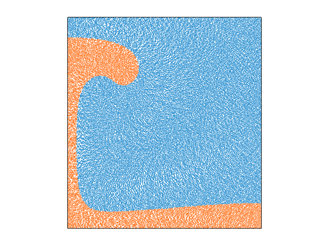

<table><tr><td></td><td></td></tr></table>

About
-----
UWGeodynamics tutorial 9 modifications document

Files
-----

File | Purpose
--- | ---
`Step1.ipynb` | A the modified notebook. 

Tests
-----

Parallel Safe
-------------

Check-list
----------
- [ ] (Required) Have you replaced the above sections with your own content? 
- [ ] (Required) Have you updated the Dockerfile to point to your required UW/UWG version? 
- [ ] (Required) Have you included a working Binder badge/link so people can easily run your model?
                 You probably only need to replace `template-project` with your repo name. 
- [ ] (Optional) Have you included an appropriate image for your model? 
